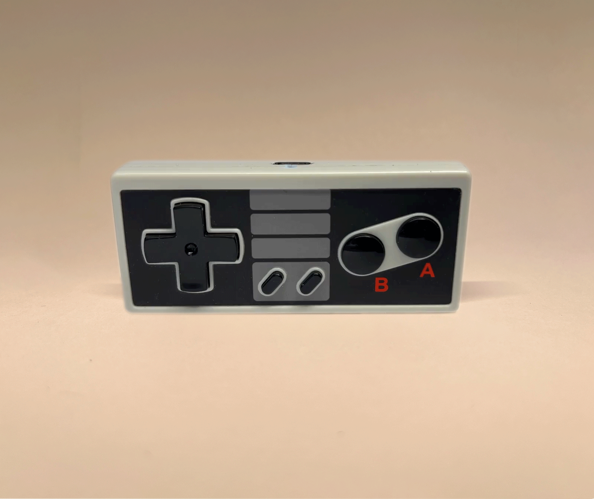

# NesPad: Nano V1.0


```
//                  
//              
// ███╗   ██╗ ██████╗ ██████╗  ██████╗  █████╗ ██████╗ 
// ████╗  ██║██╔════╝██╔════╝ ██╔═══██╗██╔══██╗██╔══██╗
// ██╔██╗ ██║█████╗   █████╗  ██████╔╝ ███████║██║  ██║
// ██║╚██╗██║██╔══╝   ╚═══██╗ ██╔═══╝  ██╔══██║██║  ██║
// ██║ ╚████║███████╗██████╔╝ ██║      ██║  ██║██████╔╝
// ╚═╝  ╚═══╝╚══════╝╚═════╝  ╚═╝      ╚═╝  ╚═╝╚═════╝
// 
//       -- Key Chain Sized Programmable Macropad **
```
---


### 🎨 **Vision**
- **8% macropad** inspired by the NES controller layout, upgraded for modern workflows and gaming.
- Powered by **ZMK firmware** for wireless Bluetooth functionality.
- **DIY-friendly** with customizable PCBs and kit options.

---

### ⚡ **Core Features**

#### 🕹️ Gaming Controller Modes
- NES controller format by default.
- SNES-inspired configuration unlockable via QMK magic.
- Contra Code easter egg for hidden features!

#### 🌈 RGB Layer Indicators
- RGB lighting dynamically indicates active layers.
- Adjustable via sequences of keystrokes for flexibility.

#### 🔄 Layer Configurations
- Jump layers to transform the macropad for:
  - Photoshop/Creative Workflow
  - Web Controller
  - Media Controller
  - Mouse & Pointing Device
  - Full Keyboard
  - Application Switcher
  - Home Assistant Controller

#### 🔋 Power & Connectivity
- Built with **Nice!Nano V2** for ultra-low power and reliable Bluetooth.
- USB support for wired connection and additional power.

#### 🔧 DIY & Expandability
- PCB kits with **step-by-step instructions** for learners.
- Support for Pro Micro microcontrollers for tinkerers.
- **Community-driven development** for feature expansion.

---

### 🌟 **Prototyping & Collaboration**
- Prototype boards to be sent to select developers.
- Open invitation for contributors to help:
  - Implement advanced firmware features.
  - Enhance button logic and layer transitions.
  - Experiment with custom QMK/ZMK integrations.

---

### Designed For
- Gamers 🎮
- Makers 🛠️
- Retro-tech enthusiasts 🕹️

---

Be part of the future of retro-inspired innovation. 🚀
---


